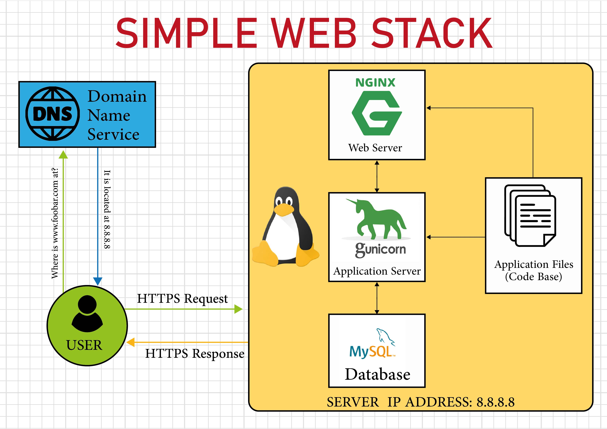

# Simple Web Stack

# INFRASTRUCTURE

### Server
A computer or software that provides data to other computers that are called clent.

### Domain Name
This is a human readable name that refer to the IP Address of a machine such as a server that is hosting a website e.g. 'www.foobar.com'.

### Webserver
A web server such as Nginx handles incoming HTTP requests from the user, serves static content, and forwards dynamic requests to the application server.

### Application server
An application server, like Gunicorn, runs the application code. It processes dynamic requests, executes the business logic, interacts with the database, and returns the processed data to the web server to be sent back to the user's browser.

### Database
A database, such as MySQL, stores and manages data used by the website. It handles queries from the application server, storing and retrieving data as needed for dynamic content generation.

The server uses the HTTPS (HyperText Transfer Protocol Secure) protocol to communicate with the user's computer. HTTPS ensures that the data exchanged between the server and the user's browser is encrypted and secure.

# ISSUES WITH THIS INFRASTRUCTURE

### Single Point of Failure (SPOF)
The entire website is hosted on a single server. If this server fails due to hardware issues, network problems, or any other reason, the entire website will become inaccessible. There is no redundancy to handle such failures.

### Downtime When Maintenance Needed
When maintenance is required, such as deploying new code or restarting the web server, the website will experience downtime. This can result in a poor user experience as the website becomes temporarily unavailable during these maintenance periods.

### Cannot Scale if Too Much Incoming Traffic
This single-server setup can handle only a limited amount of incoming traffic. If the website experiences increase in traffic, the server may become overloaded, leading to slow performance or complete unavailability. Without the ability to scale horizontally (adding more servers), the infrastructure cannot handle high traffic loads effectively.