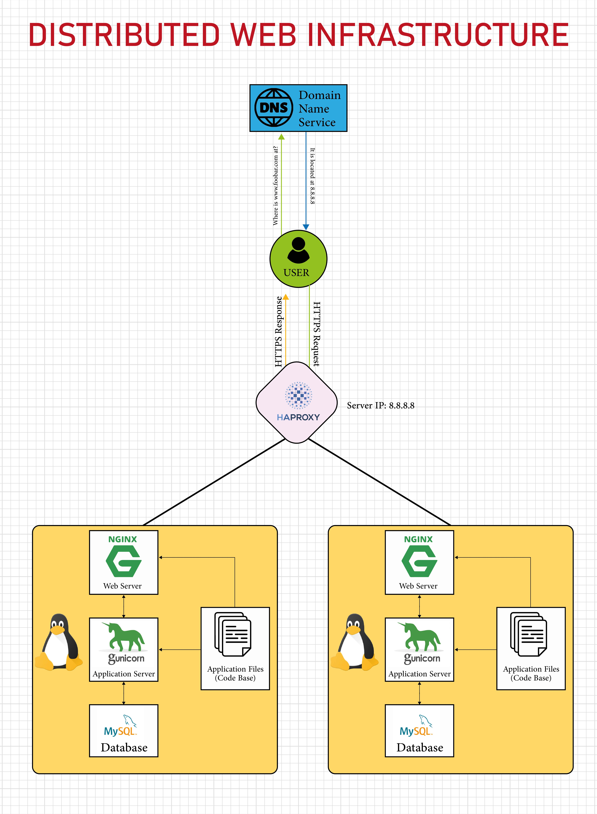

# Distributed web infrastructure

# INFRASTRUCTURE

### Server
A computer or software that provides data to other computers that are called clent.

### Domain Name
This is a human readable name that refer to the IP Address of a machine such as a server that is hosting a website e.g. 'www.foobar.com'.

### Webserver
A web server such as Nginx handles incoming HTTP requests from the user, serves static content, and forwards dynamic requests to the application server.

### Application server
An application server, like Gunicorn, runs the application code. It processes dynamic requests, executes the business logic, interacts with the database, and returns the processed data to the web server to be sent back to the user's browser.

### Database
A database, such as MySQL, stores and manages data used by the website. It handles queries from the application server, storing and retrieving data as needed for dynamic content generation.

The server uses the HTTPS (HyperText Transfer Protocol Secure) protocol to communicate with the user's computer. HTTPS ensures that the data exchanged between the server and the user's browser is encrypted and secure.

### Load-balancer
The load balancer distributes incoming traffic across the servers to ensure no single server becomes overloaded, improving reliability and performance.

# ISSUES WITH THIS INFRASTRUCTURE

### Single Point of Failure (SPOF)
The entire website is hosted on a single server. If this server fails due to hardware issues, network problems, or any other reason, the entire website will become inaccessible. There is no redundancy to handle such failures.

### Downtime When Maintenance Needed
Load Balancer: If the load balancer fails, the entire system becomes inaccessible.

### Security Issues
No Firewall: The infrastructure lacks a firewall, making it vulnerable to unauthorized access and attacks.

### Monitoring
Without monitoring, it's challenging to detect and respond to issues like server failures, high load, and security breaches.