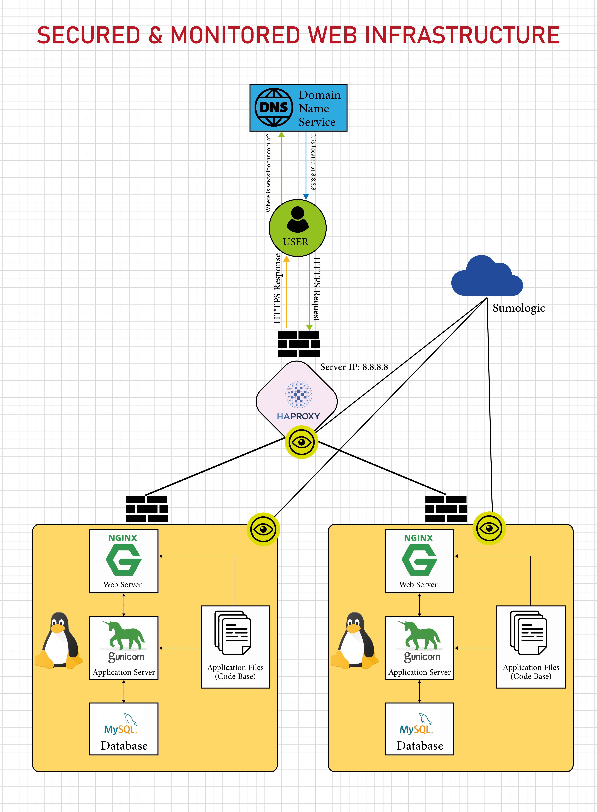

# Secured and monitored web infrastructure

# INFRASTRUCTURE

### Server
A computer or software that provides data to other computers that are called clent.

### Domain Name
This is a human readable name that refer to the IP Address of a machine such as a server that is hosting a website e.g. 'www.foobar.com'.

### Webserver
A web server such as Nginx handles incoming HTTP requests from the user, serves static content, and forwards dynamic requests to the application server.

### Application server
An application server, like Gunicorn, runs the application code. It processes dynamic requests, executes the business logic, interacts with the database, and returns the processed data to the web server to be sent back to the user's browser.

### Database
A database, such as MySQL, stores and manages data used by the website. It handles queries from the application server, storing and retrieving data as needed for dynamic content generation.

The server uses the HTTPS (HyperText Transfer Protocol Secure) protocol to communicate with the user's computer. HTTPS ensures that the data exchanged between the server and the user's browser is encrypted and secure.

### Load-balancer
The load balancer distributes incoming traffic across the servers to ensure no single server becomes overloaded, improving reliability and performance.

### Firewalls
Firewalls protect the network by controlling incoming and outgoing traffic based on security rules. They help prevent unauthorized access, attacks, and other security threats.

### HTTPS Traffic
Serving traffic over HTTPS ensures that the data is encrypted, providing security and privacy for users. This is essential for protecting sensitive information, such as login credentials and personal data.

### Monitoring
Monitoring helps in tracking the performance, availability, and health of the infrastructure. It allows for the detection of issues, performance bottlenecks, and potential security threats.

### Data Collection
The monitoring tool collects data such as server performance metrics, application logs, error rates, and network traffic. This data is sent to a centralized monitoring service (e.g., Sumologic) for analysis and alerting.

# ISSUES WITH THIS INFRASTRUCTURE

### Terminating SSL at the Load Balancer Level
If SSL is terminated at the load balancer, the traffic between the load balancer and the backend servers is not encrypted. This can be a security risk if the internal network is compromised.

### Having Only One MySQL
This creates a single point of failure. If the primary MySQL server goes down, no write operations can be performed, leading to potential data loss and application downtime.

### Servers with All the Same Components
This design can lead to resource contention, where the database, web server, and application server compete for the same resources (CPU, memory, I/O). This can degrade performance.